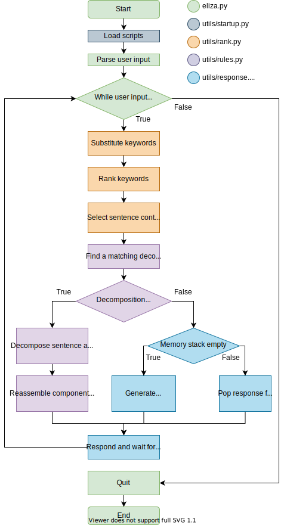

# eliza.py
**ELIZA** is a natural language processing program developed from 1964 to 1966 by Joseph Weizenbaum, 
originally implemented in MAD-SLIP. 
You can read the 1966 paper [here](https://dl.acm.org/doi/10.1145/365153.365168). 

ELIZA uses pattern matching, decomposition and reassembly rules 
to emulate a Rogerian psychotherapist.


(Inputs taken from [Weizenbaum's 1966 paper, pp.1-2.](https://dl.acm.org/doi/10.1145/365153.365168))

# Download
## Requirements
- Python 3.x 
(should work with Python 2 by adjusting back the syntax of some commands)

## Via command-line
```bash
# Clone the repository
$ git clone https://github.com/rdimaio/eliza-py
```

# Usage
## Starting the program
```bash
# Go into the project folder
$ cd eliza-py

# Execute the file
$ python eliza.py
Eliza: Hi.
You: [type something]
```

## Example conversation (using the same inputs as the original paper, pp. 1-2)
```
You: Men are all alike.
Eliza: In what way?
You: They're always bugging us about something or other.
Eliza: Can you think of a specific example?
You: Well, my boyfriend made me come here.
Eliza: Your boyfriend made you come here?
You: He says I'm depressed much of the time.
Eliza: I am sorry to hear that you are depressed.
You: It's true. I am unhappy.
Eliza: Do you think coming here will help you not to be unhappy?
You: I need some help, that much seems certain.
Eliza: What would it mean to you if you got some help?
You: Perhaps I could learn to get along with my mother.
Eliza: Tell me more about your family.
You: My mother takes care of me.
Eliza: Who else in your family takes care of you?
You: My father.
Eliza: Your father?
You: You are like my father in some ways.
Eliza: What resemblance do you see?
You: You are not very aggressive, but I think you don't want me to notice that.
Eliza: What makes you think I am not very aggressive?
You: You don't argue with me.
Eliza: Why do you think I don't argue with you?
You: You are afraid of me.
Eliza: Does it please you to believe I am afraid of you?
You: My father is afraid of everybody.
Eliza: What else comes to mind when you think of your father?
You: Bullies.
Eliza: Does that have anything to do with the fact that your boyfriend made you come here?
```

## Exiting the program
```bash
# You can type bye, goodbye, done, quit or exit. Or use CTRL+C, if you want to be rude about it...
You: bye
Eliza: Goodbye.
```

# Program flow



# Script structure

## `scripts/general.json`
This script handles general English language information that is not necessarily tied into the other script the program uses,
as well as useful inputs for the program.

- `substitutions`: specifies which keywords should be substituted before applying a custom script
- `tags`: specifies keywords within the same semantic field
- `memory_inputs`: array of keywords that prompt the generation of an additional response added to the memory stack
- `exit_inputs`: array of keywords that can be used to quit the program

## `scripts/doctor.json`
This script simulates a **Rogerian psychotherapist**.
It has been filled according to the appendix in the original paper (p. 9), including ranks.
An additional great reference is the script file from [Charles Hayen's Java implementation of ELIZA](http://chayden.net/eliza/Eliza.html).
Some small additions have been made to make the program feel a bit nicer (e.g. the program responds to greetings).

Each element in the JSON file follows this structure:
- `keyword`: keyword that the program looks for in the user's input (**after substitution**, like in the original implementation)
    - Two special keywords exist:
        - `$`: specifies that a generic answer should be given
        - `^`: specifies that an answer from the memory stack should be given
- `rank`: rank of that keyword
- `rules`: Array of decomposition rules and matching reassembly rules in the form:
    - `decomp`: Decomposition rule (using the same syntax as the original 1966 paper)
    - `reassembly`: Array of reassembly rules to be used with the decomposition rule specified in `decomp`
        - Reassembly rules use 1-indexing like in the original paper;
        note that when a `tag` in a decomposition rule is equivalent
        to two components in its reassembly rules instead of one
        (to be able to use regex)
    - `last_used_reassembly_rule`: ID of last used reassembly rule for this decomposition rule (0-indexed);
    it is incremented everytime the decomposition rule is matched and it cycles back to the beginning
    when the last reassembly rule in the array is used.


# FAQ

## Differences from original implementation

- **Keyword ranking**:
    - Original implementation: keywords are not guaranteed to be ranked in descending order;
    as seen in Fig. 2 on p. 4 of the original paper, a keyword is placed on top of the keystack
    if its rank is higher than the highest rank encountered in the sentence so far,
    otherwise it is placed on the bottom of the keystack.
    - This implementation: keywords are guaranteed to be ranked in descending order.
- **Sentence tokenization**:
    - Original implementation: if a comma/period is encountered and a keyword has already been found,
    all subsequent text is deleted (p. 2). 
    - This implementation: sentences are split based on punctuation (—,.:;-),
    and the sentence with the highest ranked keyword is chosen to be decomposed.
    - Main reasons:
        - The emphasis of the user's input may not necessarily be in the first section of the sentence
        - The section with the highest ranked keyword has a higher chance of having decomposition rules
        for that keyword, as it has a rank in the first place
- **Tags**:
    - Original implementation: `DLIST` is used to indicate tags.
    - This implementation: `tag` is used to indicate tags.
    - The functionality is the same.
- **Memory stack**:
    - Original implementation: the keyword `my` is associated with the memory stack (p. 6);
    - This implementation: the memory stack is called when no matching decomposition rule is found.

## Why are scripts stored in JSON and not CSV?
In the `doctor` script, each keyword has a **variable** amount of decomposition rules,
and each decomposition rule has a **variable** amount of reassembly rules.
I think JSON can store this information structure in a much more intuitive way.

The `general` script could be stored in `.csv` as there is no nesting,
but I preferred to use JSON again to remain consistent with the other script.

# Future work
- Allow the user to edit the script during a session by typing "edit" as in the original implementation (p. 7 of the paper)
- Translate to other languages (Italian, Spanish..)
- Consider including a randomized delay before the program responds, strengthening the human-like feel of the conversation

# References
- J. Weizenbaum, “ELIZA-a computer program for the study of natural language communication between man and machine,” Communications of the ACM, vol. 9, no. 1, pp. 36–45, Jan. 1966. [Link](https://dl.acm.org/doi/10.1145/365153.365168)

- The script file from [Charles Hayen's Java implementation of ELIZA](http://chayden.net/eliza/Eliza.html)

## Tools

- **Demo animation**: [asciinema](https://github.com/asciinema/asciinema) and [termtosvg](https://github.com/nbedos/termtosvg)
- **Flowchart**: [draw.io](draw.io)
